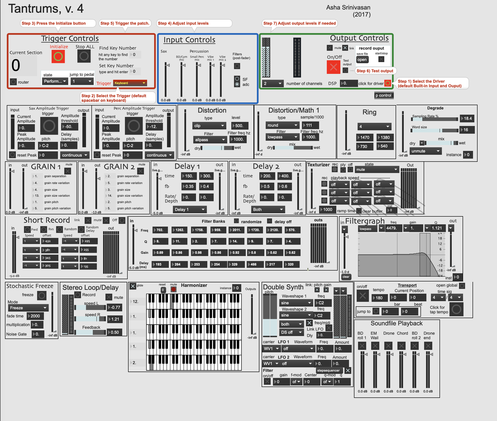
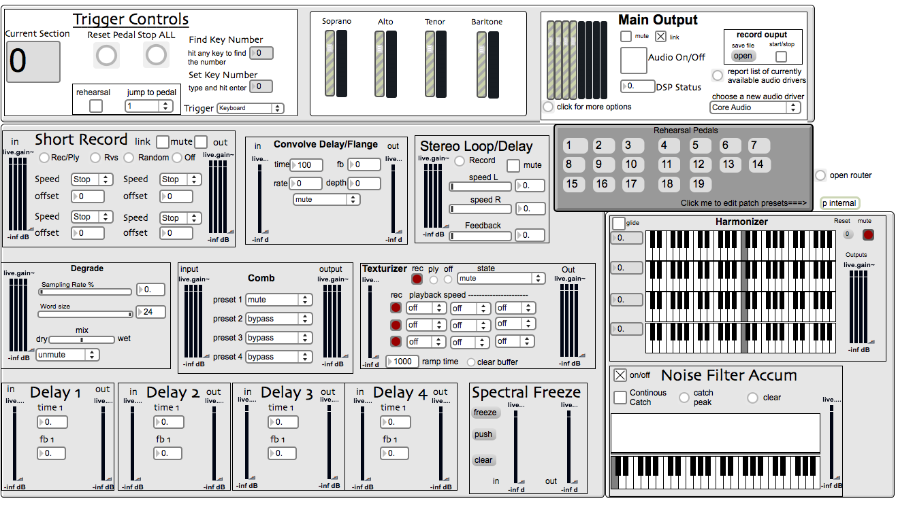

# asctools
A library of GUI oriented DSP objects for the MAX environment. This library is focused on calling objects to speed up the patch creation and composition process for electronic music. The core of the library is a set of processing modules either in mono or 8 channels. These modules can be loaded in realtime and come complete with a GUI. They are governed by a asc.triggercontrol which manages states and routing. 

To Use:

1.Copy the asctools folder onto your harddrive (a folder called externals might be a good place)

2. Add the asc.tools to your path in max by clicking "options->preferences"  and then the + sign in the bottom left corner of the window that pops up. This should add a userpath (if you've never done this it will say "userpatch_1"). Click choose under the user path you added and find the asctools on your harddrive. Also make sure the subfolders box is checkmarked.

3. copy asc.tools_start.maxpat & asc.tools_overview.maxpat to Applications/Max5/cycling74/Extras

Now You should be ready to go. All of the gui objects are in asc.modules-objects
Start by going to extras and choosing either the asc.tools_overview or the asc.tools_start patch.

4. To quickly add a module press n and then type "bpatcher @name" followed by the name of the tool, for example asc.delay is bpatcher @name asc.delay.

# Real world exmples:

[Aro Dreamscape](https://soundcloud.com/andrew-cole-4/aro-dreamscape) by Andrew Cole  
for saxophone quartet and 4 channel interactive electronics.

[All My Dreams Have Turned to Ash](https://soundcloud.com/andrew-cole-4/all-my-dreams-have-turned-to-ash) by Andrew Cole  
for violin, saxophone, trombone guitar, percussion, and 8 channel interactive electronics.

[Tantrums](https://www.youtube.com/watch?v=LqPOZeaBIRA) by Asha Srinivasan 
for saxophone, percussions, 2 or 8 channel interactive electronics.

Here is an example of what it looks like and how it can be used in a composition. Aro dreamscape uses a mix of these tools loaded dynamically and for the purposes of the composition I also have "hardwired" presets. For this library, the connections for each module are automatically created and added to a router so that routing can quickly be changed to speed composition and electroncis creation. 
Tantrums guid:

Aro Dreamscape gui:
